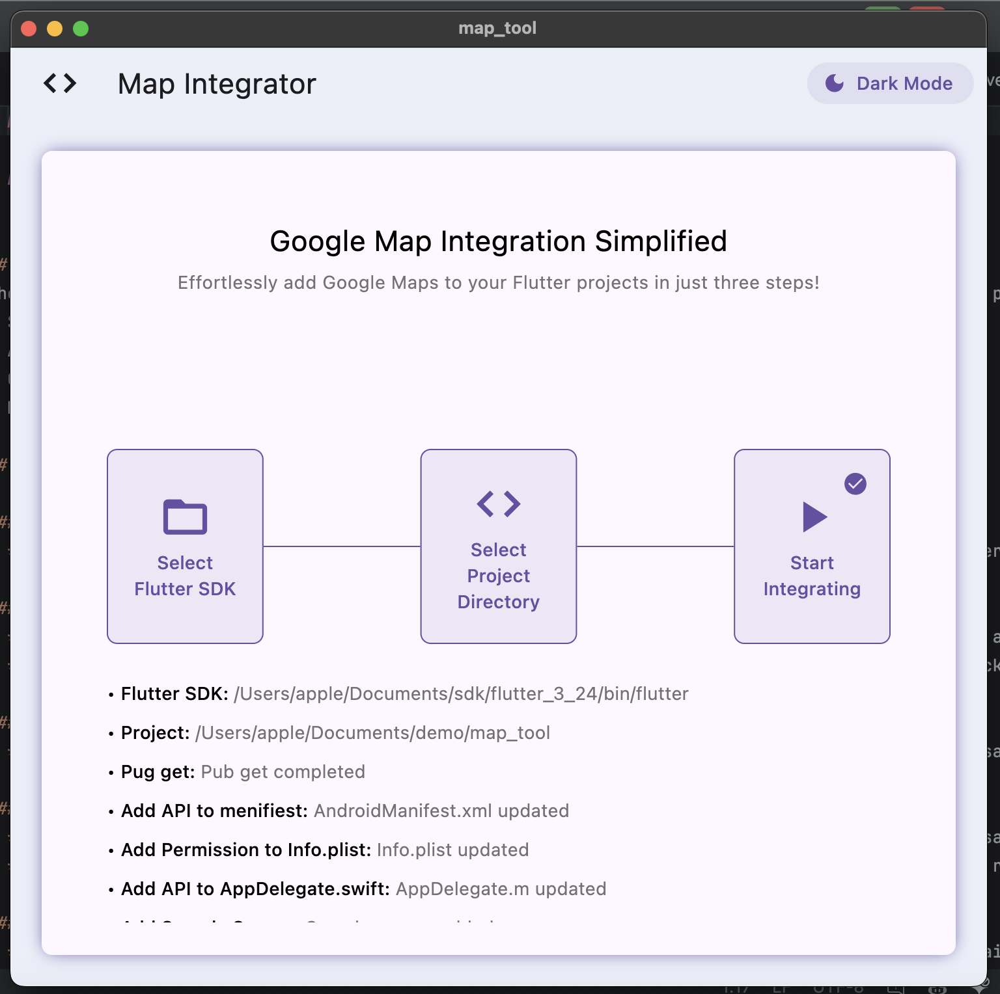
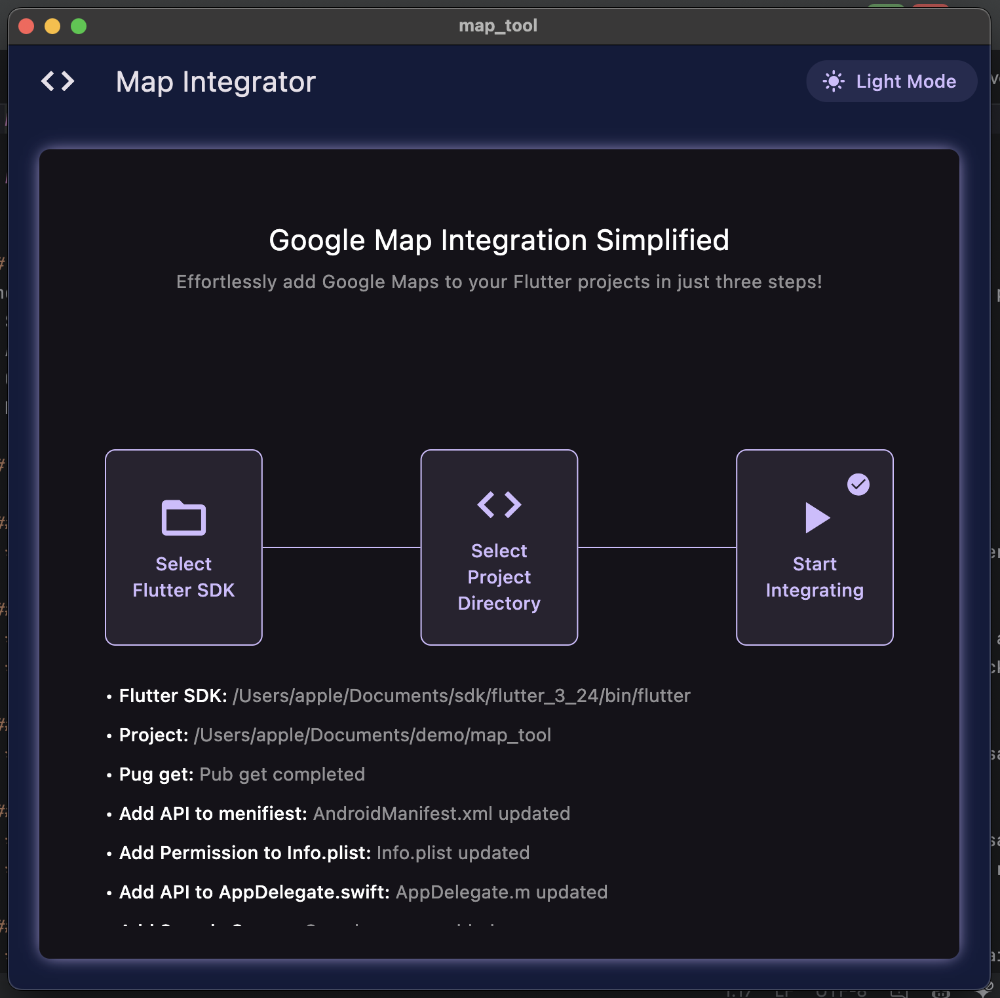

# Map Integrator

# Developer Onboarding Task: Automated Package Integration in Flutter Project

## Task Objective
The goal of this task is to create a flexible setup that automates the integration of any selected package into an existing Flutter project. The process should allow the user to:
- Select a Flutter project.
- Automatically integrate the `google_maps_flutter` package.
- Configure platform-specific settings (Android and iOS).
- Make an example of usage of Google Map.

 

## Task Steps

### Step 1: Implement Project Selection Feature
- **Create Project Selection UI**: Build a UI component (such as a file picker) that allows the user to select a Flutter project directory.

### Step 2: Automate Package Integration
- **Modify `pubspec.yaml` for Package Addition**: Write logic to update the `pubspec.yaml` file by adding the `google_maps_flutter` package.
- **Run `flutter pub get`**: Automatically execute the `flutter pub get` command to install the package in the selected project.

### Step 3: API Key or Token Management
- **Prompt for Existing API Key**: Display a dialog asking the user if they already have the necessary API key for Google Maps.

### Step 4: Platform-Specific Configuration
- **Android Configuration**: Programmatically modify the `AndroidManifest.xml` to insert any necessary configuration API keys for Google Maps. Ensure proper indentation and formatting to avoid XML errors.
- **iOS Configuration**: Programmatically update `Info.plist` or `AppDelegate.swift` to insert any required API keys or configuration for the package.

### Step 5: Create and Run a Demo
- **Add Example Widget**: Integrate a simple example widget for the Google Maps package into the main screen of the selected Flutter project.